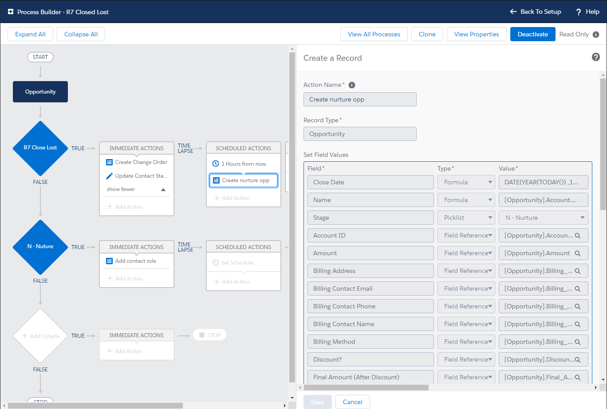
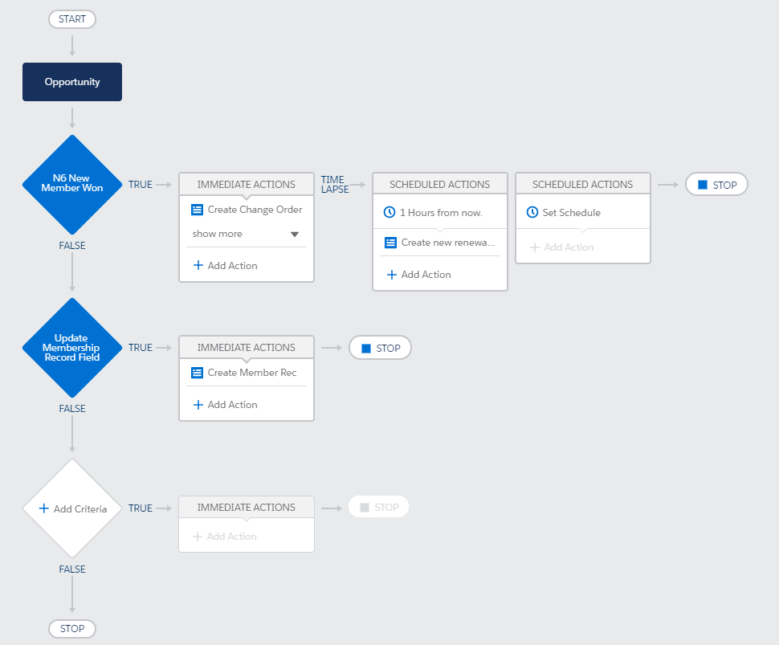

# Salesforce Journey
### [Progress in Salesforce Development](https://trailblazer.me/id/jc27)

## Superbadges
- [ ] [Lightning Web Components Specialist](https://trailhead.salesforce.com/en/content/learn/superbadges/superbadge_lwc_specialist)
- [ ] [Apex Specialist](https://trailhead.salesforce.com/en/content/learn/superbadges/superbadge_apex)
- [x] [Process Automation Specialist](https://trailhead.salesforce.com/en/content/learn/superbadges/superbadge_process_automation) - Completd 8/24/20

## Optimized Business Processes
- [X] Automate Renewals - Completed 6/26/20  
- [X] Automate Member Resignation - Completed 7/13/20 
- [X] Automate New Member Onboard - Partial Completed 8/15/20 

## Modules Completed
|Complete             |Date      |Module/Challenge Name|
|:-------------------:|----------|-----------|
|:white_check_mark:|8/26/20|[Get Started with Apex Triggers](https://trailhead.salesforce.com/en/content/learn/modules/apex_triggers/apex_triggers_intro?trail_id=force_com_dev_beginner)
|:white_check_mark:|8/26/20|[Apex Basics & Database](https://trailhead.salesforce.com/content/learn/modules/apex_database/apex_database_sosl?trail_id=force_com_dev_beginner)|
|:white_check_mark:|8/26/20|[Write SOQL Queries](https://trailhead.salesforce.com/content/learn/modules/apex_database/apex_database_soql?trail_id=force_com_dev_beginner)|
|:white_check_mark:|8/26/20|[Manipulate Records with DML](https://trailhead.salesforce.com/en/content/learn/modules/apex_database/apex_database_dml?trail_id=force_com_dev_beginner)|
|:white_check_mark:|8/25/20|[Get Started with Apex](https://trailhead.salesforce.com/en/content/learn/modules/apex_database/apex_database_intro?trail_id=force_com_dev_beginner)|
|:white_check_mark:|8/24/20|[Automate Setup](https://trailhead.salesforce.com/en/content/learn/superbadges/superbadge_process_automation) - [PR Detail](https://github.com/jackmchou/sfquickstart/pull/18)|
|:white_check_mark:|8/24/20|[Create Flow for Opportunities](https://trailhead.salesforce.com/en/content/learn/superbadges/superbadge_process_automation)|
|:white_check_mark:|8/24/20|[Automate Opportunities](https://trailhead.salesforce.com/en/content/learn/superbadges/superbadge_process_automation)|
|:white_check_mark:|8/23/20|[Create Sales Process and Validate Opportunities](https://trailhead.salesforce.com/en/content/learn/superbadges/superbadge_process_automation) - [PR Details](https://github.com/jackmchou/sfquickstart/pull/16)|
|:white_check_mark:|8/23/20|[Create Robot Setup Object](https://trailhead.salesforce.com/en/content/learn/superbadges/superbadge_process_automation)|
|:white_check_mark:|8/22/20|[Automate Accounts](https://trailhead.salesforce.com/en/content/learn/superbadges/superbadge_process_automation) - [PR Details](https://github.com/jackmchou/sfquickstart/pull/15)|
|:white_check_mark:|8/21/20|[Automate Leads](https://trailhead.salesforce.com/en/content/learn/superbadges/superbadge_process_automation)|
|:white_check_mark:|8/21/20|[Trailhead Playground Management](https://trailhead.salesforce.com/content/learn/modules/trailhead_playground_management)|
|:white_check_mark:|8/20/20|[Workflow Rule Migration](https://trailhead.salesforce.com/en/content/learn/modules/workflow_migration)|
|:white_check_mark:|8/20/20|[Leads & Opportunities for Lightning Experience](https://trailhead.salesforce.com/en/content/learn/modules/leads_opportunities_lightning_experience)|
|:white_check_mark:|8/19/20|[Lightning Flow](https://trailhead.salesforce.com/content/learn/modules/business_process_automation)|
|:white_check_mark:|5/24/20|[Convert Lightning Web Components Open Source to Salesforce](https://trailhead.salesforce.com/en/content/learn/projects/convert-lightning-web-components-open-source-to-salesforce?trail_id=build-apps-lightning-web-components-open-source) - [PR Details](https://github.com/jackmchou/sfquickstart/pull/12)|
|:white_check_mark:|5/20/20|[Access Salesforce Data with Lightning Web Components Open Source](https://trailhead.salesforce.com/en/content/learn/projects/access-salesforce-data-with-lightning-web-components-open-source?trail_id=build-apps-lightning-web-components-open-source) - [PR Details](https://github.com/jackmchou/sfquickstart/pull/10)|
|:white_check_mark:|5/18/20|[Build Your First Application with Lightning Web Components Open Source](https://trailhead.salesforce.com/content/learn/projects/build-your-first-app-with-lightning-web-components-open-source?&utm_source=trailhead&utm_medium=web-landing-page&utm_campaign=salesforce_javascript_developers&utm_content=lwc_open_source_trailhead_project) - [PR Details](https://github.com/jackmchou/sfquickstart/pull/8)|
|:black_square_button:|          |[Find and Fix Bugs with Apex Replay Debugger](https://trailhead.salesforce.com/en/content/learn/projects/find-and-fix-bugs-with-apex-replay-debugger)|
|:black_square_button:|          |[Package.xml Metadata Management](https://trailhead.salesforce.com/en/content/learn/modules/package-xml)|
|:black_square_button:|          |[Lightning Web Components Basics](https://trailhead.salesforce.com/en/content/learn/modules/lightning-web-components-basics)|